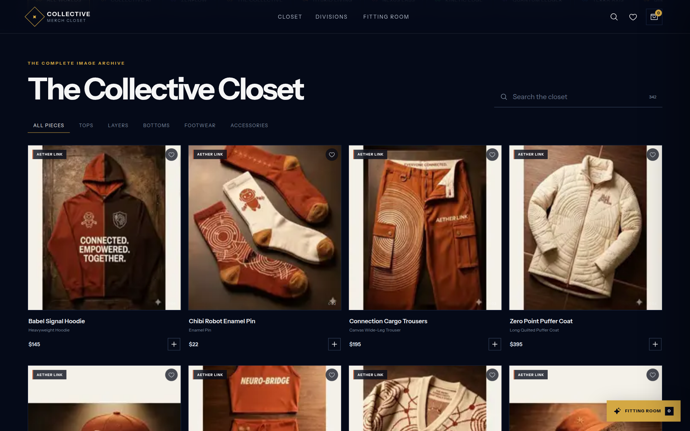
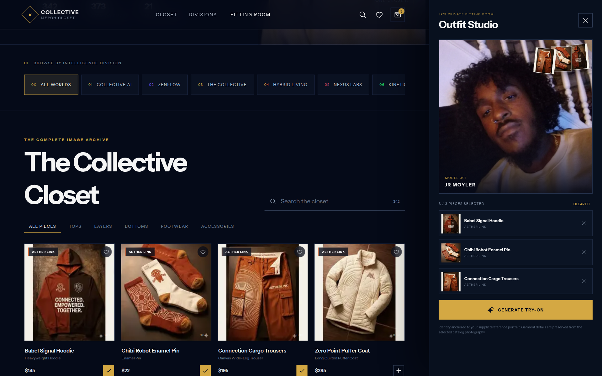

<div align="center">

# Collective Merch Closet

Wear the ecosystem. 342 pieces across 21 Collective AI divisions, with an AI fitting room.

[](LICENSE)
[](package.json)

</div>





## What it is

A single-page merch storefront for the Collective AI portfolio:

- **The closet** — every catalog piece, filterable by division, garment type, and full-text search (including OCR'd text from the product photography).
- **Divisions** — 21 brand worlds, each with its own accent color, tagline, and tags.
- **Favorites** — heart pieces from the grid and browse just your saved picks.
- **Outfit Studio** — pick up to three pieces, then generate an AI try-on photo of JR wearing the outfit via the OpenAI Images API.

All product imagery ships as an embedded sprite atlas, so the gallery works fully offline (a service worker caches the app shell). Only the try-on generation calls out to the API.

## Quick start

```bash
git clone https://github.com/jrmoyler/Collective-Merch-Closet.git
cd Collective-Merch-Closet
npm install
cp .env.example .env   # add OPENAI_API_KEY to enable the fitting room
npm run dev
```

Open [localhost:5173](http://localhost:5173). The closet works without a key; the **Generate try-on** button needs `OPENAI_API_KEY` in `.env` (dev) or in your Vercel project settings (production).

## Configuration

| Variable | Default | Purpose |
| --- | --- | --- |
| `OPENAI_API_KEY` | — | Required for `/api/try-on` |
| `OPENAI_IMAGE_MODEL` | `gpt-image-2` | Image edit model |
| `OPENAI_IMAGE_QUALITY` | `high` | Image quality |
| `OPENAI_API_BASE_URL` | `https://api.openai.com/v1` | API base override |

## Project layout

| Path | Purpose |
| --- | --- |
| `src/App.jsx` | The whole storefront UI |
| `src/data.js` | Joins catalog, assets, and OCR data into the `MERCH` list |
| `src/merch-sprite.js` | Generated 18×19 sprite atlas of all product photos |
| `src/model.js` | Embedded model reference photo used by the fitting room |
| `api/try-on.js` | Vercel serverless function that generates try-on images |
| `data/` | Source catalog, asset index, and OCR text |
| `scripts/` | Generators for the sprite atlas and catalog JSON |

## Deploying

The repo is set up for Vercel (`vercel.json`): static Vite build plus the `api/try-on.js` function. Set `OPENAI_API_KEY` in the project's environment variables.

## Credits

Forked from [tandpfun/wardrobe](https://github.com/tandpfun/wardrobe) and rebuilt as the Collective AI merch storefront.

## License

[MIT](LICENSE)
